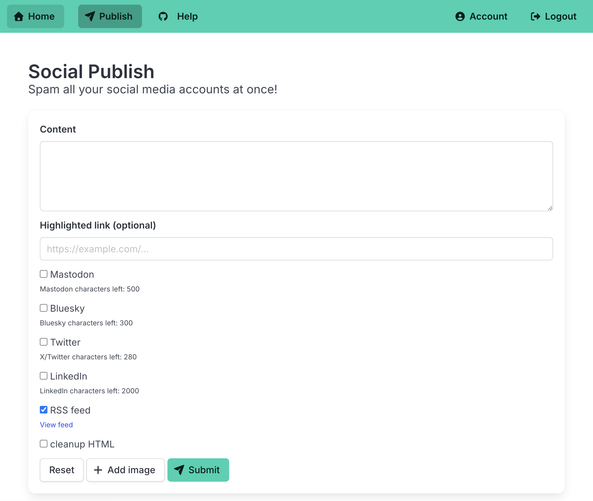

# Social Publish

[](https://github.com/alexandru/social-publish/actions/workflows/build.yaml) [](https://github.com/alexandru/social-publish/actions/workflows/deploy.yml)

In implementing [POSSE](https://indieweb.org/POSSE) (publish on your own site, syndicate elsewhere), I need to publish to multiple social networks. Social Publish provides direct API integration for X (Twitter), Mastodon, Bluesky, and LinkedIn, plus an RSS feed for automation.

## What it does

- Publish the same post to multiple networks from one form
- Upload images with alt-text, or let an LLM generate alt-text automatically
- Provide an RSS feed for external automation tools like IFTTT

## Supported networks

| Network | Auth model | Notes |
| --- | --- | --- |
| [X (Twitter)](https://twitter.com) | OAuth 1.0a | Connect via `/account` after setup |
| [Mastodon](https://joinmastodon.org/) | Personal access token | Scoped to `write:statuses` and `write:media` |
| [Bluesky](https://bsky.app/) | App password | One-time app password required |
| [LinkedIn](https://linkedin.com) | OAuth2 | Token refresh is handled automatically |

<p align="center">
  
</p>

**Table of Contents**

- [What it does](#what-it-does)
- [Supported networks](#supported-networks)
- [Self-hosting](#self-hosting)
  - [Bluesky credentials](#bluesky-credentials)
  - [Mastodon credentials](#mastodon-credentials)
  - [Twitter setup](#twitter-setup)
  - [LinkedIn setup](#linkedin-setup)
  - [LLM setup (Optional)](#llm-setup-optional)
- [RSS feed](#rss-feed)
- [Developing](#developing)
- [License](#license)

## Self-hosting

My `docker-compose` setup:

```yaml
version: "3.8"

services:
  # ...
  social-publish:
    container_name: social-publish
    image: ghcr.io/alexandru/social-publish:latest
    restart: always
    healthcheck:
      test: ["CMD-SHELL", "curl --head http://localhost:3000/ || exit 1"]
    ports:
      - "3000:3000"
    env_file:
      - ./envs/social-publish.env
    networks:
      - external_network
```

Where `./envs/social-publish.env` contains:

```sh
# Where the server is hosted — needed for correctly generating an RSS feed
BASE_URL="https://your-hostname.com"

# The server's Basic AUTH credentials
SERVER_AUTH_USERNAME="your-username"
SERVER_AUTH_PASSWORD="your-password"

# Bluesky credentials
BSKY_HOST="https://bsky.social"
BSKY_USERNAME="your-username"
BSKY_PASSWORD="your-password"

# Mastodon credentials
MASTODON_HOST="https://mastodon.social"
MASTODON_ACCESS_TOKEN="your-access-token"

# Twitter OAuth1 key and secret (Consumer Keys in the Developer Portal)
TWITTER_OAUTH1_CONSUMER_KEY="Api Key"
TWITTER_OAUTH1_CONSUMER_SECRET="Api Secret Key"

# LinkedIn OAuth2 credentials
LINKEDIN_CLIENT_ID="your-client-id"
LINKEDIN_CLIENT_SECRET="your-client-secret"

# LLM for alt-text generation (optional)
# Configure the API endpoint, key, and model for your LLM provider
# For OpenAI:
LLM_API_URL="https://api.openai.com/v1/chat/completions"
LLM_API_KEY="your-openai-api-key"
LLM_MODEL="gpt-4o-mini"
# For Mistral:
# LLM_API_URL="https://api.mistral.ai/v1/chat/completions"
# LLM_API_KEY="your-mistral-api-key"
# LLM_MODEL="pixtral-12b-2409"

# Used for authentication (https://jwt.io)
JWT_SECRET="random string"
```

### Bluesky credentials

For Bluesky, you'll need an "app password".

- Go here to create one: <https://bsky.app/settings/app-passwords>
- Copy the password
- Set the `BSKY_PASSWORD` environment variable to it

Keep it safe, as it grants access to everything.

### Mastodon credentials

For Mastodon, you'll need an "access token". Here's how to get one:

- Go to: <https://mastodon.social/settings/applications>
- Create a "New Application"
- Select `write:statuses` and `write:media` for permissions, and unselect everything else
- Click on the newly created application
- Copy "_your access token_"
- Set the `MASTODON_ACCESS_TOKEN` environment variable to it

### Twitter setup

For Twitter, we're working with Oauth1.

- Go to: <https://developer.twitter.com/en/portal/projects-and-apps>
- Create a project and app
- In the "_Keys and tokens_" section of the app, generate "_Consumer Keys_" and copy the generated "_App Key and Secret_"
- In the app's settings, go to "_User authentication settings_" and add as the "_Callback URL_": `https://<your-domain.com>/api/twitter/callback` (replace `<your-domain.com>` with your domain, obviously)
- Set the `TWITTER_OAUTH1_CONSUMER_KEY` and the `TWITTER_OAUTH1_CONSUMER_SECRET` environment variables
- Once the server is running, go to `https://<your-domain.com>/account` and click on "_Connect Twitter_"

### LinkedIn setup

For LinkedIn, we're working with OAuth2.

- Go to: <https://www.linkedin.com/developers/apps>
- Click "_Create app_" and fill in the required details
- In the "_Auth_" tab, copy the "_Client ID_" and "_Client Secret_"
- Add the following redirect URL: `https://<your-domain.com>/api/linkedin/callback` (replace `<your-domain.com>` with your actual domain)
- In the "_Products_" tab, request access to:
  - "_Sign In with LinkedIn using OpenID Connect_" (provides `openid` and `profile` scopes)
  - "_Share on LinkedIn_" (provides `w_member_social` scope)
- Set the `LINKEDIN_CLIENT_ID` and `LINKEDIN_CLIENT_SECRET` environment variables
- Once the server is running, go to `https://<your-domain.com>/account` and click on "_Connect LinkedIn_"

**Note:** LinkedIn access tokens expire after 60 days. The system automatically refreshes tokens using the refresh token, which is valid for 1 year. You'll need to reconnect if the refresh token expires.

### LLM setup (Optional)

The application can integrate with LLM providers to automatically generate alt-text descriptions for images. This feature is optional and supports any OpenAI-compatible API (including OpenAI, Mistral AI, and other providers).

**Supported providers:**

- **OpenAI** (e.g., GPT-4o-mini): <https://platform.openai.com/api-keys>
- **Mistral AI** (e.g., Pixtral): <https://console.mistral.ai/api-keys/>
- Any OpenAI-compatible API endpoint

**Configuration:**

1. Get an API key from your chosen provider
2. Set the environment variables:
   - `LLM_API_URL`: The API endpoint URL (e.g., `https://api.openai.com/v1/chat/completions`)
   - `LLM_API_KEY`: Your API key
   - `LLM_MODEL`: Model name (e.g., `gpt-4o-mini` for OpenAI, `pixtral-12b-2409` for Mistral)

## RSS feed

The RSS feed is exposed at `/rss` (e.g., `http://localhost:3000/rss`). Use it with automation tools like [ifttt.com](https://ifttt.com) if you want additional workflows beyond the direct integrations.

## Developing

This is a Kotlin multiplatform project with:

- **Backend**: Ktor server with Arrow for functional programming
- **Frontend**: Compose for Web (Kotlin/JS)
- **Build**: Gradle with Kotlin DSL

### Development Commands

To run the development environment with live reload:

```sh
make dev
```

This starts both the backend server (port 3000) and frontend dev server (port 3002) with hot reload enabled.

To run backend and frontend separately:

```sh
# Backend only
make dev-backend

# Frontend only
make dev-frontend
```

You can navigate to <http://localhost:3002> for the frontend, while the backend is available at <http://localhost:3000>.

### Building

To build the project:

```sh
make build
```

To run tests:

```sh
make test
```

To check and fix code formatting:

```sh
make lint    # Check formatting
make format  # Auto-format code
```

### Docker Images

To build and test the Docker images locally:

```sh
# Build and run JVM image
make docker-run-jvm
```

To run tests in a Docker environment that matches production:

```sh
# Run all tests in Docker
make test-docker

# Run specific ImageMagick tests in Docker
make test-imagemagick-docker
```

See the [Makefile](./Makefile) for all available commands.

## License

This project is licensed under the GNU Affero General Public License v3 (AGPL-3.0). See [LICENSE.txt](./LICENSE.txt) for details.
