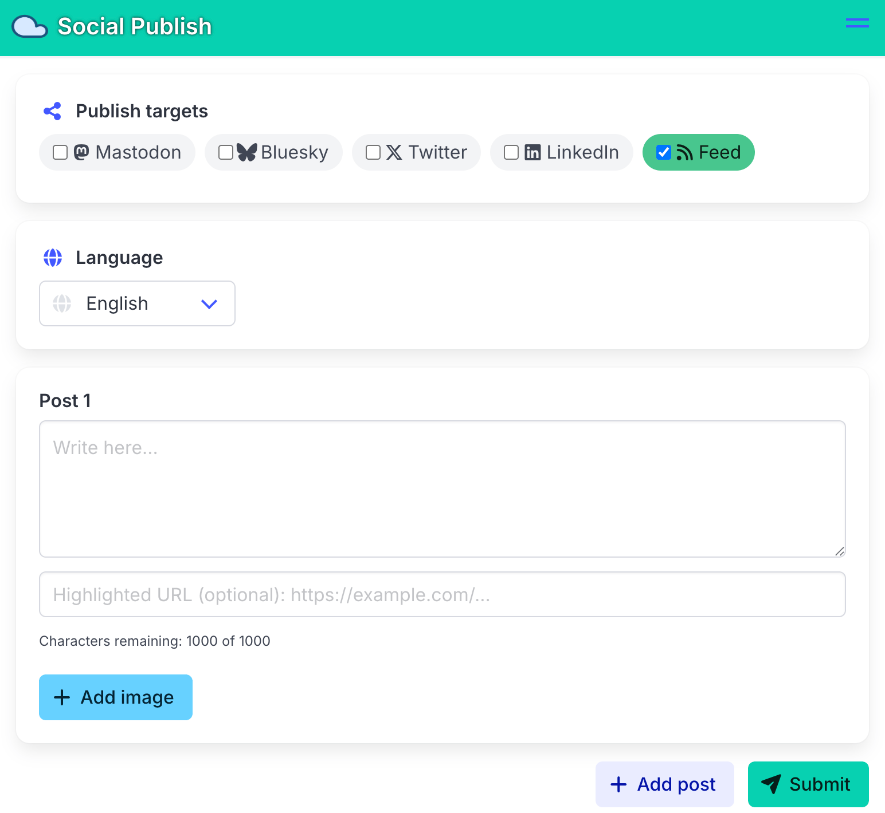

# Social Publish

[](https://github.com/alexandru/social-publish/actions/workflows/build.yaml) [](https://github.com/alexandru/social-publish/actions/workflows/deploy.yml)

In implementing [POSSE](https://indieweb.org/POSSE) (publish on your own site, syndicate elsewhere), I need to publish to multiple social networks. Social Publish provides direct API integration for X (Twitter), Mastodon, Bluesky, and LinkedIn, plus an RSS feed for automation.

## What it does

- Publish the same post to multiple networks from one form
- Upload images with alt-text, or let an LLM generate alt-text automatically
- Provide an RSS feed for external automation tools like IFTTT
- Per-user social credentials configured from the web UI (no per-platform environment variables to manage)

## Supported networks

- [X (Twitter)](https://twitter.com)
- [Mastodon](https://joinmastodon.org/)
- [Bluesky](https://bsky.app/)
- [LinkedIn](https://linkedin.com)

<p align="center">
  
</p>

**Table of Contents**

- [What it does](#what-it-does)
- [Supported networks](#supported-networks)
- [Self-hosting](#self-hosting)
  - [Configuration](#configuration)
  - [Bluesky credentials](#bluesky-credentials)
  - [Mastodon credentials](#mastodon-credentials)
  - [Twitter setup](#twitter-setup)
  - [LinkedIn setup](#linkedin-setup)
  - [LLM setup (Optional)](#llm-setup-optional)
- [CLI Commands](#cli-commands)
- [RSS feed](#rss-feed)
- [License](#license)

## Self-hosting

My `docker-compose` setup:

```yaml
version: "3.8"

services:
  # ...
  social-publish:
    container_name: social-publish
    image: ghcr.io/alexandru/social-publish:latest
    restart: always
    healthcheck:
      test: ["CMD-SHELL", "curl --head http://localhost:3000/ || exit 1"]
    ports:
      - "3000:3000"
    env_file:
      - ./envs/social-publish.env
    networks:
      - external_network
```

### Configuration

Where `./envs/social-publish.env` contains:

```sh
# Where the server is hosted — needed for correctly generating an RSS feed
BASE_URL="https://your-hostname.com"

# Database
DB_PATH="/data/socialpublish.db"

# File storage
UPLOADED_FILES_PATH="/data/uploads"

# Optional: port to listen on (default 3000)
# HTTP_PORT=3000
```

Social platform credentials (Bluesky, Mastodon, Twitter, LinkedIn) and the LLM
configuration are **per-user** and are set from the web UI under `/account`.
The first user is created with the CLI (see [CLI Commands](#cli-commands));
additional users can self-register.

### Bluesky credentials

For Bluesky, you'll need an "app password".

- Go here to create one: <https://bsky.app/settings/app-passwords>
- Copy the password
- Set it from `/account` in the web UI

Keep it safe, as it grants access to everything.

### Mastodon credentials

For Mastodon, you'll need an "access token". Here's how to get one:

- Go to: <https://mastodon.social/settings/applications>
- Create a "New Application"
- Select `write:statuses` and `write:media` for permissions, and unselect everything else
- Click on the newly created application
- Copy "_your access token_"
- Set it from `/account` in the web UI

### Twitter setup

For Twitter, we're working with Oauth1.

- Go to: <https://developer.twitter.com/en/portal/projects-and-apps>
- Create a project and app
- In the "_Keys and tokens_" section of the app, generate "_Consumer Keys_" and copy the generated "_App Key and Secret_"
- In the app's settings, go to "_User authentication settings_" and add as the "_Callback URL_": `https://<your-domain.com>/api/twitter/callback` (replace `<your-domain.com>` with your domain, obviously)
- Set the consumer key and secret from `/account` in the web UI
- Click on "_Connect Twitter_" in `/account`

### LinkedIn setup

For LinkedIn, we're working with OAuth2.

- Go to: <https://www.linkedin.com/developers/apps>
- Click "_Create app_" and fill in the required details
- In the "_Auth_" tab, copy the "_Client ID_" and "_Client Secret_"
- Add the following redirect URL: `https://<your-domain.com>/api/linkedin/callback` (replace `<your-domain.com>` with your actual domain)
- In the "_Products_" tab, request access to:
  - "_Sign In with LinkedIn using OpenID Connect_" (provides `openid` and `profile` scopes)
  - "_Share on LinkedIn_" (provides `w_member_social` scope)
- Set the client ID and client secret from `/account` in the web UI
- Click on "_Connect LinkedIn_" in `/account`

**Note:** LinkedIn access tokens expire after 60 days. The system automatically refreshes tokens using the refresh token, which is valid for 1 year. You'll need to reconnect if the refresh token expires.

### LLM setup (Optional)

The application can integrate with LLM providers to automatically generate alt-text descriptions for images. This feature is optional and supports any OpenAI-compatible API (including OpenAI, Mistral AI, and other providers).

Configure the LLM endpoint from `/account` in the web UI. Any OpenAI-compatible
API works; examples include:

- **OpenAI** (e.g., GPT-4o-mini): <https://platform.openai.com/api-keys>
- **Mistral AI** (e.g., Pixtral): <https://console.mistral.ai/api-keys/>

## CLI Commands

Social Publish includes several CLI commands for managing users. These commands
are particularly useful when running the application in a Docker container.

### Using the CLI in Docker

When running in Docker, you can use the `./cli` wrapper script for cleaner output with minimal logging:

```sh
# Using docker exec with the cli wrapper (minimal logging)
docker exec -it social-publish /opt/app/cli create-user --username myuser --password mypassword

# Or use java-exec directly with verbose flag for detailed logging
docker exec -it social-publish /opt/app/java-exec -jar /opt/app/app.jar create-user --username myuser --password mypassword --verbose
```

### Available Commands

**Create a new user:**

```sh
./cli create-user --username <username> --password <password>
# Or with environment variables:
./cli create-user --db-path $DB_PATH --username <username> --password <password>
```

**Change a user's password:**

```sh
./cli change-password --username <username> --new-password <new-password>
# Prompts for password if not provided:
./cli change-password --username <username>
```

**Change a user's username:**

```sh
./cli change-username --current-username <old-username> --new-username <new-username>
# Prompts for usernames if not provided:
./cli change-username
```

**Generate a BCrypt password hash:**

```sh
./cli gen-bcrypt-hash --password <password>
# Or let it prompt you (hides input):
./cli gen-bcrypt-hash
```

### Verbose Logging

By default, CLI commands use minimal logging (warnings and errors only). To see detailed logs, add the `--verbose` or `-v` flag:

```sh
./cli create-user --username myuser --password mypass --verbose
```

## RSS feed

The RSS feed is exposed at `/rss` (e.g., `http://localhost:3000/rss`). Use it with automation tools like [ifttt.com](https://ifttt.com) if you want additional workflows beyond the direct integrations.

## License

This project is licensed under the GNU Affero General Public License v3 (AGPL-3.0). See [LICENSE.txt](./LICENSE.txt) for details.
